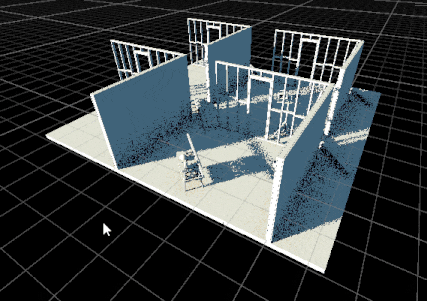

Was just playing around with this. I ended up porting it to Job System, strapped a [BurstCompile] on it and boom, free performance.

I also tried out some bare bones ray tracing stuff just for fun. It actually isn't as fast as I thought it would be.

